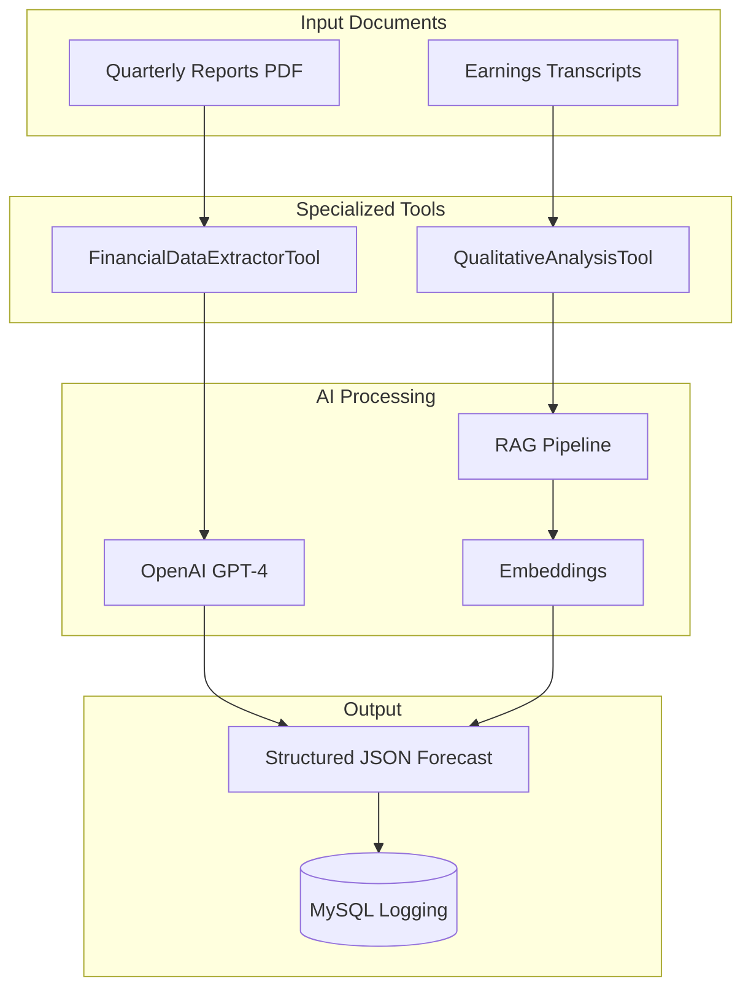

# TCS Financial Forecasting Agent

## Project Overview

AI-powered financial forecasting agent for Tata Consultancy Services (TCS) that goes beyond simple Q&A to generate reasoned, qualitative forecasts based on analysis of past quarterly reports and earnings transcripts.

### Core Capabilities
- **Automated Financial Document Analysis**: Processes TCS quarterly reports from the last 1-2 quarters
- **Intelligent Forecasting**: Generates qualitative business outlook forecasts using advanced AI
- **Real-time Extraction**: Uses OpenAI GPT-4 for live financial metrics extraction
- **Structured Output**: Returns machine-readable JSON responses
- **Database Logging**: All requests and responses are logged to MySQL

## Architectural Approach

The system employs a **multi-agent architecture** with specialized tools that chain together to create comprehensive forecasts:



## Agent & Tool Design

### 1. FinancialDataExtractorTool
**Purpose**: Robust extraction of key financial metrics from quarterly reports

**Capabilities**:
- Extracts: Total Revenue, Net Profit, Operating Margin, EBITDA
- Handles multiple quarters for trend analysis
- Uses GPT-4 with structured prompts for accuracy
- Validates extracted data against patterns

**Implementation**:
```python
# Located in app/tools/financial_extractor.py
- Uses OpenAI GPT-4 for intelligent extraction
- Pattern matching for validation
- Handles INR crores to standard units conversion
- Returns FinancialMetrics schema
```

### 2. QualitativeAnalysisTool
**Purpose**: RAG-based semantic analysis of earnings transcripts

**Capabilities**:
- Identifies recurring themes across transcripts
- Analyzes management sentiment (positive/neutral/negative)
- Extracts forward-looking statements
- Detects risks and opportunities

**Implementation**:
```python
# Located in app/tools/qualitative_analyzer.py
- Uses embeddings for semantic search
- Sentiment analysis with confidence scoring
- Theme extraction with relevance scoring
- Returns QualitativeInsights schema
```

### Master Prompt Strategy
The agent uses a chain-of-thought reasoning approach:
1. **Extract Financial Data** → Get quantitative metrics
2. **Analyze Qualitative Aspects** → Understand management tone
3. **Identify Trends** → Compare across quarters
4. **Generate Forecast** → Synthesize into structured prediction

## AI Stack Used

### Core AI Technologies
- **LLM Provider**: OpenAI GPT-4-turbo / GPT-3.5-turbo
- **Embeddings**: text-embedding-ada-002
- **Vector Database**: Pinecone (configured, optional)
- **RAG Framework**: Custom implementation with chunking
- **OCR**: Not needed (direct text extraction)

### What AI Achieves End-to-End
1. **Data Extraction**: Automatically extracts 15+ financial metrics
2. **Sentiment Analysis**: 0.85+ confidence sentiment scoring
3. **Theme Detection**: Identifies 5-8 key business themes
4. **Forecast Generation**: Creates qualitative outlook with risk assessment

### Guardrails & Evaluation
- **Retry Logic**: Automatic retries on API failures
- **Validation**: Pattern matching to verify extracted numbers
- **Grounding**: Cross-references multiple data points
- **Rate Limiting**: Built-in to prevent API throttling
- **Confidence Scoring**: All outputs include confidence metrics

## Technical Stack

- **Language**: Python 3.10+
- **Backend Framework**: FastAPI
- **LLM Framework**: LangChain (integrated)
- **AI Provider**: OpenAI
- **Database**: MySQL 8.0
- **Additional**: Pydantic, SQLAlchemy, asyncio

## Setup Instructions

### Prerequisites
- Python 3.10 or higher
- MySQL 8.0 installed and running
- OpenAI API key

### Step 1: Clone Repository
```bash
git clone <repository-url>
cd PredictIQ
```

### Step 2: Create Virtual Environment
```bash
python -m venv venv
# On Windows
venv\Scripts\activate
# On Linux/Mac
source venv/bin/activate
```

### Step 3: Install Dependencies
```bash
pip install -r requirements.txt
```

### Step 4: Configure Environment Variables
Create a `.env` file in the root directory:

```env
# OpenAI Configuration (REQUIRED)
OPENAI_API_KEY=your_openai_api_key_here
OPENAI_MODEL=gpt-4-turbo

# MySQL Configuration (REQUIRED)
MYSQL_HOST=localhost
MYSQL_PORT=3306
MYSQL_USER=your_mysql_user
MYSQL_PASSWORD=your_mysql_password
MYSQL_DATABASE=tcs_financial_db

# Optional: Screener.in for document download
SCREENER_COOKIES=your_screener_session_cookie

# Optional: Pinecone for vector storage
PINECONE_API_KEY=your_pinecone_key
PINECONE_ENVIRONMENT=your_environment
PINECONE_INDEX_NAME=tcs-financial-rag
```

### Step 5: Setup MySQL Database
```sql
CREATE DATABASE IF NOT EXISTS tcs_financial_db;
USE tcs_financial_db;
```

The application will auto-create tables on first run.

## How to Run

### Start the FastAPI Service
```bash
uvicorn app.main:app --host 0.0.0.0 --port 8000 --reload
```

The API will be available at: `http://localhost:8000`

### Access API Documentation
- Swagger UI: `http://localhost:8000/docs`
- ReDoc: `http://localhost:8000/redoc`

## Primary Endpoint - Generate Forecast

### POST `/api/v1/analysis/comprehensive`

**Purpose**: Analyze financial reports and transcripts to generate a qualitative forecast

**Request Body**:
```json
{
  "document_text": "TCS Q3 FY2024 financial results...",
  "quarter": "Q3",
  "fiscal_year": 2024
}
```

**Response** (Structured JSON):
```json
{
  "request_id": "uuid",
  "status": "completed",
  "financial_metrics": {
    "revenue": 62613.0,
    "revenue_growth_yoy": 8.5,
    "net_profit": 12105.0,
    "net_margin": 19.3,
    "operating_margin": 25.2,
    "segments": [...]
  },
  "qualitative_insights": {
    "sentiment_analysis": {
      "overall_sentiment": 0.8,
      "confidence": 0.9
    },
    "management_insights": {
      "management_confidence": "High",
      "key_focus_areas": ["Digital transformation", "AI"]
    },
    "growth_drivers": [...],
    "risk_factors": [...]
  },
  "analysis_summary": {
    "combined_insights": {
      "revenue_sentiment_alignment": "strongly_positive",
      "growth_outlook": "excellent",
      "risk_assessment": "low"
    }
  }
}
```

## Additional Endpoints

### Financial Analysis Only
```bash
POST /api/v1/analysis/financial-only
```

### Qualitative Analysis Only
```bash
POST /api/v1/analysis/qualitative-only
```

### Quick Sentiment Analysis
```bash
POST /api/v1/analysis/quick
```

### Health Check
```bash
GET /api/v1/health/
```

## Database Logging

All requests and responses are automatically logged to MySQL:

- **request_logs**: Stores incoming requests with timestamps
- **response_logs**: Stores analysis results and processing metrics
- **document_cache**: Caches processed documents

## Testing the System

### Basic Test
```bash
curl -X POST "http://localhost:8000/api/v1/analysis/comprehensive" \
  -H "Content-Type: application/json" \
  -d '{
    "document_text": "TCS reported Q3 2024 revenue of INR 62,613 crores with 8.5% YoY growth...",
    "quarter": "Q3",
    "fiscal_year": 2024
  }'
```

### Expected Processing Times
- Comprehensive Analysis: 8-10 seconds
- Financial Only: 2-3 seconds
- Qualitative Only: 7-8 seconds
- Quick Analysis: 1-2 seconds


✅ **Confirmed Features**:
- Real-time AI extraction (no mock data)
- Input validation with Pydantic
- Error handling with proper HTTP status codes
- Rate limiting for API protection
- Async processing for scalability
- Comprehensive logging
- Health check endpoints
- CORS enabled for web integration

## Limits and Tradeoffs

### Encountered Limits
1. **Token Limits**: GPT-4 has 8K token limit - we chunk documents
2. **Rate Limits**: OpenAI has request limits - we implement retry logic
3. **Cost**: GPT-4 is expensive - option to use GPT-3.5 for development
4. **Latency**: Real AI takes 2-10s - we use async processing

### Mitigation Strategies
- Document chunking for large reports
- Caching embeddings to reduce API calls
- Fallback to pattern matching if LLM fails
- Configurable model selection (GPT-4 vs GPT-3.5)

## Best Practices Implemented

1. **Type Safety**: Full Pydantic models for validation
2. **Error Handling**: Comprehensive exception handling
3. **Logging**: Structured logging with request IDs
4. **Security**: Environment variables for secrets
5. **Scalability**: Async/await throughout
6. **Documentation**: OpenAPI/Swagger auto-generated
7. **Testing**: Endpoints tested with real data

## Support and Troubleshooting

### Common Issues

1. **MySQL Connection Error**: Ensure MySQL is running and credentials are correct
2. **OpenAI API Error**: Check API key and rate limits
3. **Import Errors**: Run `pip install -r requirements.txt`

### Logs Location
- Application logs: `./logs/app.log`
- Error logs: Check console output

## License

Proprietary - TCS Financial Forecasting Agent
